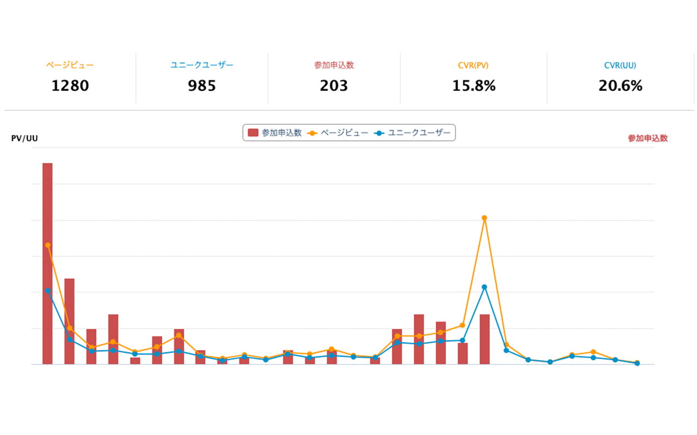

# connpass advanced stats


[connpass](https://connpass.com/)のイベント統計ページにより発展的な統計情報を追加する Chrome 拡張です。

## Prerequisites

- versions

| runtime | version  |
| ------- | -------- |
| node    | v18.12.1 |
| npm     | 8.19.2   |
| yarn    | 1.22.19  |

## Getting Started

プロジェクトは`yarn workspace`で構成されているため、プロジェクトルートで以下のコマンドを実行すると、ビルドが行なえます。

```bash
yarn install
yarn build
```

ローカル環境でデバッグを行うためには、chrome 拡張機能の設定画面で`デベロッパーモード`を ON にした上で、`パッケージ化されていない拡張機能を読み込む`というところで`extensions`フォルダを指定すると、使えるようになります。

FYI: [React でサクッと chrome の拡張機能をつくる](<https://zenn.dev/tokku5552/articles/how-to-make-chrome-extension#%E4%BD%BF%E3%81%84%E6%96%B9(%E3%83%AD%E3%83%BC%E3%82%AB%E3%83%AB%E3%83%93%E3%83%AB%E3%83%89)>)

## セキュリティチェック

依存パッケージの脆弱性を検知するため、CI では `npm audit` を実行しています。脆弱性が検出されるとジョブが失敗し、Pull Request のマージがブロックされます。

開発者はローカルでも以下のコマンドでチェックを実行できます。

```bash
yarn npm audit --all
```

脆弱性が報告された場合は `yarn npm audit --fix` やパッケージの更新を行い、必要に応じて Dependabot などで対応してください。

## Contributing

BUG の報告や機能追加の要望等は[ISSUE Template](https://github.com/tokku5552/connpass-advanced-stats/issues/new/choose)から該当するものを選んで、ISSUE を作成してください。
